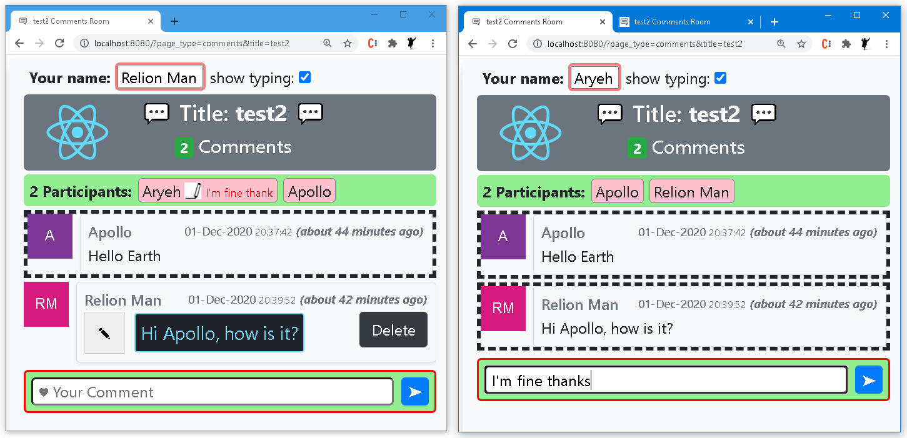
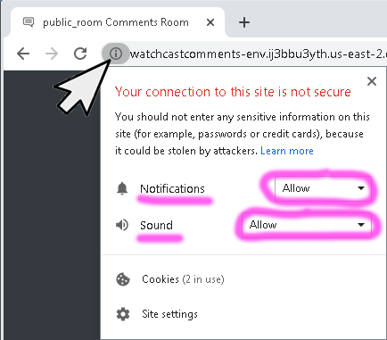

# React and Node.js Advanced Comment support - full implementation

This is an advanced fully working example, AWS compatible, Websockets based chat application written in Node.js and React.
Comments can be added, removed and edited, all being reflected in real-time in all participant browsers using the same application URL.
Also, the pre-typed text is (optionally) previewed in real-time in all other participants browsers.

### Installation

1.  Clone this repo and cd into it.
2.  Run `node app.js`
3.  Run `npm start`
4.  Use the link with a title: http://localhost/comments/?title=test_room
5.  or possibly for a pre set user: http://localhost/comments/?title=test_room&name=jonny
6.  also browse : http://localhost/monitor

## App snapshots

## Author

Aryeh Tuchfeld (relion)

based on [QCode.in](https://www.qcode.in/learn-react-by-creating-a-comment-app) tutorial.

## Keywords

chat, comments, solved, working, full-stack, react, node.js, websocket.

### Enabling Browser Notifications

For testing the Notifications on real hostname, you can enable: Insecure origins treated as secure in chrome://flags/
or (when available) simpliy right click here:

### Configure on AWS WebSocekt

1. The WebSocket Server is set to port: 3030 (you can choose a differnt number).
2. See my video instructions on How to Configure the Node.js with WebSocket on AWS Elastic Beanstalk:

   

## Live Demo

[Click here](http://watchcast.live/comments?title=public_room)
