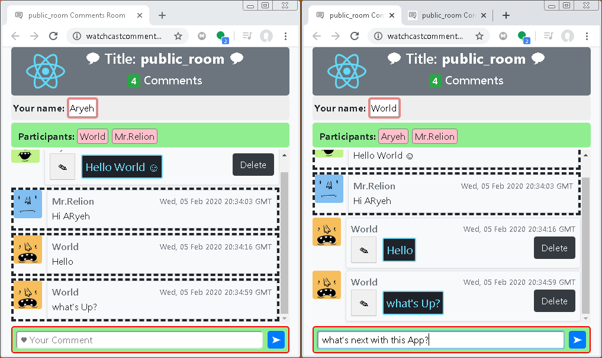

## React Advanced Comment

This is a simple fully working example, AWS compatible, Websockets based chat application written in Node.js and React.
Comments can be added, removed and edited all being reflected in real-time in all participant browsers using the same application URL.

### Installation

1.  Clone this repo and cd into it.
2.  Run `node app.js`
3.  Run `npm start`
4.  Use the link with a title: http://localhost/comments/?title=test_room

### Author

Aryeh Tuchfeld (relion)

based on [QCode.in](https://www.qcode.in/learn-react-by-creating-a-comment-app) tutorial.

### Keywords

chat, room, comments, solved, working, full-stack, react, node.js, websocket.

### Configure AWS WebSocekt

1. Notice the file: \.ebextensions\enable-websockets.config
2. The WebSocket Server is set to port: 3030 (you can choose a differnt number).
3. See my video instructions on How to Configure the Node.js with WebSocket on AWS Elastic Beanstalk:

   
